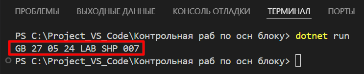

## Итоговая контрольная работа по основному блоку
### Выполнил: Шутылев П.В. 27.05.2024
### Решение:
* **`Обьявлено два массива.`**
* **`Применяем метод void,используем цикл for, в котором проверяем соответствие длинне массива. Внутри цикла проверяем условие меньше или равно 3 символам, если да ,то элемент первого массива заносится в переменную count элемента второго массива. После присвоения увеличивается переменная count на 1 и возвращается к циклу for в котором i увеличивается на 1.`**
* **`В конце программы печать массива.`**

#### Пример полученного результата:
* **`GB 27 05 24 LAB SHP 007`**

  Чтобы вставить изображение в текст, достаточно написать следующее:

